# 짬뽕하네스

짬뽕하네스는 Codex가 새 프로젝트를 시작할 때 바로 코드를 만들지 않고, 요구사항 정리부터 PRD, issue 분해, writing plan, 리뷰, 구현, 검증, 학습 회수까지 같은 순서로 진행하게 만드는 private workflow harness입니다.

이 저장소는 npm package가 아닙니다. 설치란 template 내용을 대상 프로젝트 root에 직접 놓는 것입니다.

GitHub template source는 `vibedong/jjamppong-harness`입니다.

## Why

새 프로젝트가 흔들리는 지점은 보통 비슷합니다.

- 요구사항이 모호한데 바로 구현함
- 폴더 구조가 작업마다 달라짐
- 계획 리뷰 없이 큰 방향을 확정함
- 검증 없이 완료라고 말함
- 다음 채팅으로 넘어가면 맥락이 끊김
- 한 프로젝트에서 배운 내용을 다음 프로젝트에 재사용하지 못함

짬뽕하네스는 이 흐름을 파일과 규칙으로 고정합니다. Codex가 매번 같은 입구로 들어오고, 같은 산출물을 만들고, 같은 검증 기준으로 끝내게 하는 것이 목적입니다.

## What You Get

| Surface | Purpose |
| --- | --- |
| `AGENTS.md` | Codex가 반드시 따라야 할 최상위 작업 규칙 |
| `harness/rules/` | workflow, hard rules, module type 기준 |
| `harness/state/` | 현재 프로젝트의 결정 상태와 승인된 구조 |
| `harness/docs/tasks/` | PRD, issue, brief, writing plan, review, verification 산출물 |
| `harness/docs/solutions/` | 다음 프로젝트에도 재사용할 수 있는 학습 |
| `modules/` | 승인된 뒤 실제 제품 코드가 들어가는 공간 |
| `module-template/` | 새 module을 만들 때 쓰는 기본 틀 |
| `proposals/` | live rule을 바꾸기 전 검토하는 제안 공간 |
| `handoff.md` | 사용자가 요청했을 때만 갱신하는 새 채팅 인계 문서 |

## How It Works

```mermaid
flowchart LR
  A["Request intake"] --> B["Planning gate"]
  B --> C["PRD approval"]
  C --> D["Issue breakdown"]
  D --> E["Issue approval"]
  E --> F["Task brief"]
  F --> G["Writing plan"]
  G --> H["Plan review"]
  H --> I["Implementation"]
  I --> J["Verification"]
  J --> K["Learning capture"]
```



The default full workflow is:

1. Request Intake
2. setup-matt-pocock-skills Readiness Check
3. grill-with-docs
4. to-prd
5. User PRD Approval
6. to-issues
7. User Issue Approval
8. Task Brief
9. Superpowers Writing Plans
10. Mandatory Plan Review Question
11. Implementation / Apply
12. Verification
13. ce-compound
14. Archive Task Artifacts
15. Learning Update Question

작은 작업도 기본적으로 같은 흐름을 탑니다. 예외를 만들고 싶으면 live rule을 바로 바꾸지 말고 `proposals/`에서 먼저 검토합니다.

## Requirements

사용자는 아래 준비가 필요합니다.

- GitHub 계정
- 이 private template 저장소에 접근할 권한
- Git
- GitHub CLI, 선택 사항이지만 추천
- Codex 앱
- Matt Pocock skills
- Superpowers
- gstack review skills
- Compound Engineering `ce-compound`
- vowline

Matt Pocock skills가 없다면 먼저 설치합니다.

```bash
npx skills@latest add mattpocock/skills
```

Readiness 기준은 `harness/docs/agents/matt-pocock-skills.md`에 있습니다.

## Installation

설치 대상 폴더 자체가 harness root입니다. `F:/mptech`에 설치한다면 최종 구조는 `F:/mptech/AGENTS.md`, `F:/mptech/harness/`, `F:/mptech/modules/`가 바로 보여야 합니다.

### Recommended Installer

이 하네스는 npm package처럼 설치하는 라이브러리가 아닙니다. GitHub template source를 임시로 읽어서 대상 프로젝트 폴더에 펼치는 project bootstrap입니다.

Codex가 짧은 설치 요청을 받으면 직접 `git clone <template> <target>` 하지 말고, 이 스크립트를 우선 사용해야 합니다.

```powershell
.\scripts\install-jjamppong-harness.ps1 vibedong/jjamppong-harness.git F:mptech
```

예상 결과:

```text
F:/mptech/
  AGENTS.md
  README.md
  harness/
  modules/
```

설치 후 `origin`은 template source가 아니라 project repository여야 합니다. 예를 들어 `F:/mptech`면 기본 project origin은 `https://github.com/vibedong/mptech.git`입니다. commit과 push는 여전히 사용자의 명시 승인 전까지 하지 않습니다.

### Natural Language Install

Codex에게 짧게 말해도 됩니다.

```text
<template-repo-or-url> <target-path>에 설치해줘
```

예:

```text
vibedong/jjamppong-harness.git F:mptech에 설치해줘
```

이 형식은 이렇게 해석되어야 합니다.

```text
template source: <template-repo-or-url>
target root: normalized <target-path>
project slug: last folder name of target root
```

Windows drive shorthand는 설치 전에 정규화합니다. 예를 들어 `<drive>:<folder>`는 `<drive>:/<folder>`로 해석합니다.

설치 결과는 반드시 target root 바로 아래에 생겨야 합니다.

```text
<target-root>/
  AGENTS.md
  README.md
  CONTEXT.md
  handoff.md
  harness/
  modules/
  module-template/
  proposals/
```

잘못된 결과:

```text
<target-root>/jjamppong-harness/AGENTS.md
```

Codex가 이 짧은 문장을 받으면 다음 순서로 처리해야 합니다.

1. 가능하면 `scripts/install-jjamppong-harness.ps1`를 사용합니다.
2. `<target-path>`를 정규화했다고 먼저 말합니다.
3. `<template-repo-or-url>`는 template source로만 사용합니다.
4. 최종 project root는 정규화된 `<target-root>`입니다.
5. `<target-root>`가 기존 git repo면 `origin`을 보존합니다. 단, `origin`이 template source라면 잘못된 설치 상태이므로 project repo origin으로 바꿉니다.
6. `<target-root>`가 비어 있거나 repo가 아니면 target folder name으로 project repository를 만들거나 확인하고, `origin`이 project repo를 가리키게 합니다.
7. `README.md`, `AGENTS.md`, `harness/`, `modules/`, `module-template/`, `proposals/` 충돌이 있으면 덮어쓰기 전에 멈추고 물어봅니다.
8. 완료 전 `AGENTS.md`, `harness/`, `modules/`가 `<target-root>` 바로 아래 있는지 확인합니다.
9. 완료 전 `origin`이 template source가 아닌지 확인합니다.

### New Project From Template

새 프로젝트는 GitHub template 기능으로 프로젝트 전용 private repository를 만듭니다.

```powershell
Push-Location 'F:/'
gh repo create <project-name> --private --template vibedong/jjamppong-harness --clone
Pop-Location
```

예상 결과:

```text
F:/<project-name>/
  AGENTS.md
  README.md
  CONTEXT.md
  handoff.md
  harness/
  modules/
  module-template/
  proposals/
```

완료 후 `origin`은 template source가 아니라 새 project repository를 가리켜야 합니다.

```powershell
git -C 'F:/<project-name>' remote -v
```

### Apply Harness Into Existing Repo Root

이미 `F:/mptech` 같은 프로젝트 repository가 있으면 template source를 중첩 clone하지 않습니다. template 내용을 project root에 복사하고, 기존 `origin`은 유지합니다.

Rules:

- Final files must be `F:/mptech/AGENTS.md`, `F:/mptech/harness/`, `F:/mptech/modules/`.
- Do not leave the files under `F:/mptech/jjamppong-harness/`.
- Copy template contents into the project root excluding `.git/`.
- Preserve the existing project repository `origin`.
- Stop on top-level collisions such as `README.md`, `AGENTS.md`, `harness/`, or `modules/`.

Safe PowerShell flow:

```powershell
$target = (Resolve-Path -LiteralPath 'F:/mptech').Path
$beforeOrigin = git -C $target remote get-url origin
if ($LASTEXITCODE -ne 0 -or [string]::IsNullOrWhiteSpace($beforeOrigin)) {
  throw "Target must be an existing git repository with an origin remote"
}

$tempBaseRaw = (Resolve-Path -LiteralPath ([IO.Path]::GetTempPath())).Path
$tempBase = $tempBaseRaw.TrimEnd([IO.Path]::DirectorySeparatorChar, [IO.Path]::AltDirectorySeparatorChar)
$tempRoot = Join-Path $tempBase ('jjamppong-harness-' + [guid]::NewGuid().ToString('N'))

try {
  git clone https://github.com/vibedong/jjamppong-harness.git $tempRoot
  if ($LASTEXITCODE -ne 0) { throw "Template clone failed" }

  $source = (Resolve-Path -LiteralPath $tempRoot).Path
  if (-not $source.StartsWith($tempBase + [IO.Path]::DirectorySeparatorChar, [StringComparison]::OrdinalIgnoreCase) -or -not (Split-Path -Leaf $source).StartsWith('jjamppong-harness-')) {
    throw "Unexpected temp clone path: $source"
  }

  $collisions = @()
  foreach ($item in Get-ChildItem -LiteralPath $source -Force) {
    if ($item.Name -eq '.git') { continue }
    $destination = Join-Path $target $item.Name
    if (Test-Path -LiteralPath $destination) {
      $collisions += $destination
    }
  }
  if ($collisions) {
    $collisions
    throw "Destination collisions found; choose merge, skip, or overwrite per path before continuing"
  }

  foreach ($item in Get-ChildItem -LiteralPath $source -Force) {
    if ($item.Name -eq '.git') { continue }
    Copy-Item -LiteralPath $item.FullName -Destination $target -Recurse -Force
  }

  $afterOrigin = git -C $target remote get-url origin
  if ($LASTEXITCODE -ne 0 -or $afterOrigin -ne $beforeOrigin) {
    throw "origin changed from $beforeOrigin to $afterOrigin"
  }

  foreach ($required in @('AGENTS.md', 'README.md', 'CONTEXT.md', 'handoff.md', 'harness', 'modules', 'module-template', 'proposals')) {
    if (-not (Test-Path -LiteralPath (Join-Path $target $required))) {
      throw "Missing required root item: $required"
    }
  }

  foreach ($nestedName in @('jjamppong-harness', 'ourosuper-harness')) {
    if (Test-Path -LiteralPath (Join-Path $target $nestedName)) {
      throw "Nested $nestedName folder was created"
    }
  }

  git -C $target remote -v
}
finally {
  if (Test-Path -LiteralPath $tempRoot) {
    $resolvedTemp = (Resolve-Path -LiteralPath $tempRoot).Path
    if (-not $resolvedTemp.StartsWith($tempBase + [IO.Path]::DirectorySeparatorChar, [StringComparison]::OrdinalIgnoreCase) -or -not (Split-Path -Leaf $resolvedTemp).StartsWith('jjamppong-harness-')) {
      throw "Refusing to remove unexpected temp path: $resolvedTemp"
    }
    Remove-Item -LiteralPath $resolvedTemp -Recurse -Force
  }
}
```

## First Prompt

새 프로젝트 저장소를 만든 뒤 Codex에서 생성된 프로젝트 폴더 자체를 열고 이렇게 말합니다.

```text
이 프로젝트를 짬뽕하네스 방식으로 제대로 기획하고 실행 준비해줘.
AGENTS.md와 harness/rules를 먼저 읽고 Full Workflow대로 진행해줘.
PRD 초안 후 내 승인을 받고, issue 분해 후 다시 내 승인을 받은 다음,
task brief와 writing plan까지 만든 뒤 구현 전에 리뷰 여부를 물어봐.
아직 구현하지 마.
```

## Directory Layout

```text
<project-root>/
  AGENTS.md
  README.md
  CONTEXT.md
  handoff.md
  harness/
    docs/
      agents/
      adr/
      solutions/
      tasks/
        active/<slug>/
        archive/<slug>/
    rules/
      workflow.md
      rules.md
      module-types.md
    state/
      intake.md
      planning.md
      module-structure.md
      compound.md
  module-template/
  proposals/
  modules/
```

## Operating Rules

| Rule | Meaning |
| --- | --- |
| Root means root | 하네스 파일은 프로젝트 폴더 바로 아래에 있어야 합니다. |
| Project remote only | 실제 project root의 `origin`은 project repo를 가리켜야 합니다. |
| Planning first | PRD와 issue 승인을 거치기 전에는 구현하지 않습니다. |
| Review before build | 구현 전에는 Mandatory Plan Review Question을 거칩니다. |
| Modules are gated | `modules/` 코드는 module structure 승인 뒤에만 만듭니다. |
| Handoff is explicit | `handoff.md`는 사용자가 요청할 때만 갱신합니다. |
| No silent publish | commit, push, PR, merge, release는 현재 채팅에서 명시 승인 후에만 실행합니다. |

## Common Mistakes

### Files Landed One Folder Too Deep

잘못된 구조:

```text
F:/mptech/jjamppong-harness/AGENTS.md
```

원하는 구조:

```text
F:/mptech/AGENTS.md
F:/mptech/harness/
F:/mptech/modules/
```

해결은 project repository root로 파일을 옮기거나, 새 project repo를 만든 뒤 `F:/`에서 template clone을 다시 시작하는 것입니다.

### Origin Still Points To The Template

프로젝트 root의 `origin`이 template source라면 아직 설치 완료가 아닙니다.

```powershell
git -C 'F:/mptech' remote -v
```

`https://github.com/vibedong/jjamppong-harness.git`가 보이면 project repo로 바꿔야 합니다.

```powershell
gh repo create vibedong/mptech --private
git -C 'F:/mptech' remote set-url origin https://github.com/vibedong/mptech.git
git -C 'F:/mptech' push -u origin main
```

### Codex Starts Coding Immediately

아래처럼 규칙 파일을 먼저 읽게 합니다.

```text
이 저장소의 AGENTS.md와 harness/rules를 먼저 읽고,
Full Workflow대로 진행해줘.
```

### Modules Are Created Too Early

`modules/` 아래 코드는 `harness/state/module-structure.md`가 승인된 뒤에만 만듭니다. 그 전에는 기획 산출물을 `harness/docs/tasks/active/<slug>/` 아래에 둡니다.

## AGENTS.md Management Plugin

This repository includes an optional local Codex plugin at `plugins/agents-md-management/`.

Use it when `AGENTS.md` behavior is confusing or needs maintenance:

- `agents-md-chain-audit` checks which instruction files Codex actually loads.
- `agents-md-improver` scores instruction files and proposes targeted fixes.
- `revise-agents-md` turns reusable session learnings into approved instruction updates.

This plugin is not part of the mandatory harness workflow. It is not installed into a personal Codex marketplace unless the user explicitly asks for that later.

## Maintaining The Template

template 원본을 고칠 때는 `vibedong/jjamppong-harness`를 clone한 template-maintenance checkout에서 작업합니다.

실제 프로젝트를 만들 때는 이 template 원본을 `F:/mptech/jjamppong-harness`로 clone하지 않습니다. `F:/mptech` 자체가 project repository이자 harness root가 되게 만듭니다.

```powershell
git status --short --branch
```

이미 template에서 만들어진 project root에는 변경사항이 자동으로 반영되지 않습니다. 필요한 변경은 각 project repository에서 따로 반영합니다.

## Summary

짬뽕하네스는 프로젝트 폴더 자체에 설치되는 private workflow template입니다. Codex가 요구사항을 정리하고, 승인 가능한 문서로 나누고, 리뷰와 검증을 거친 뒤에만 `modules/`에서 실제 제품 작업을 시작하게 만듭니다.
